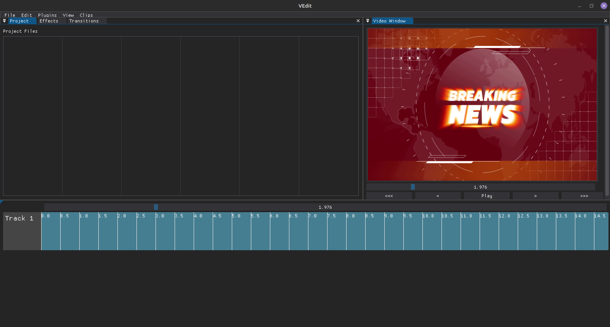
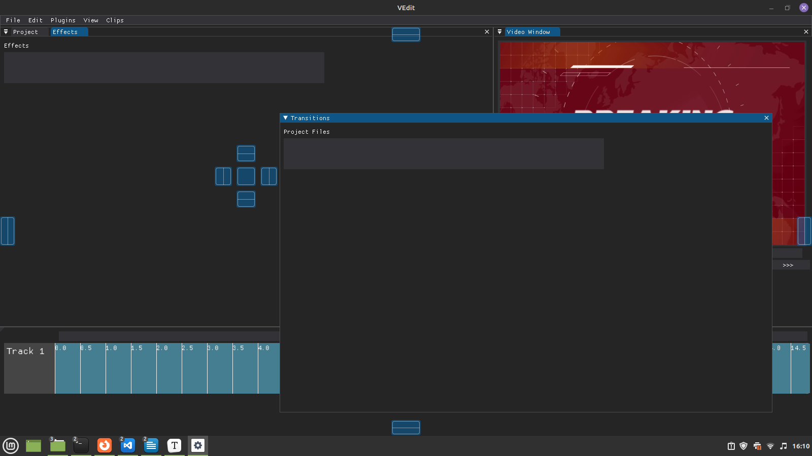
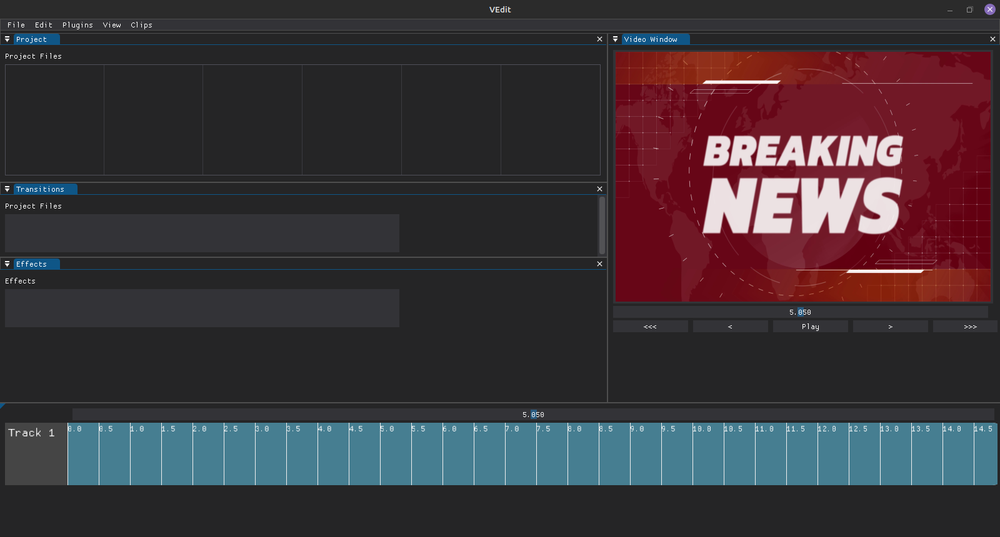

# VEdit
VEdit is an open-source, highly extensible non-linear video editor written in Python.

**Note:** This application is still in development and **not** ready for use.

## Features

These features are either planned or currently in development, please be patient with the bugs

### Plugin System

VEdit has a very basic yet powerful plugin system. The core plugins are located in the src/core_plugins folder, this contains the GUI, video player, and other plugins needed for the core functionality of VEdit. The file "loadorder.txt" is used to determine the exact order which these plugins are loaded in. General users shouldn't need to mess with these files unless you're making modifications to the VEdit core

Custom/user created plugins can be added to the src/plugins folder, and the settings.ini file can be used to enable/disable plugins.   

### Window Docking

Customize your editor exactly how you want it to be with our window docking functionality!

Your editor will also maintain its' layout throughout reboots!

### Timeline

The timeline is used to align your video clips, transitions, audio files, and other elements you want to add to a video.

#### Scrubbing

#### Zooming

#### Adding Clips

### Video Player

#### Scrubbing

#### Rotating/Resizing

#### Adding Text
